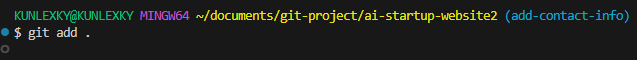
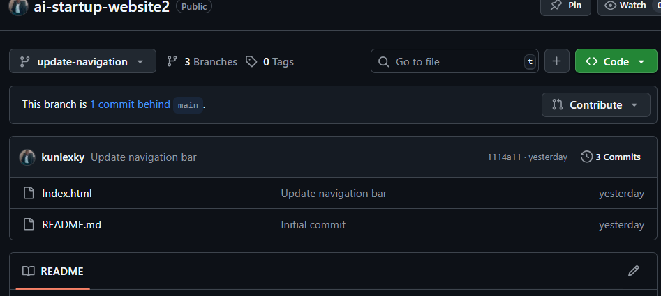
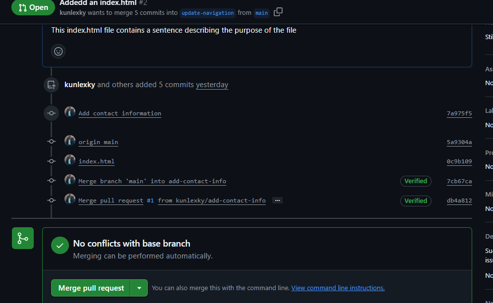
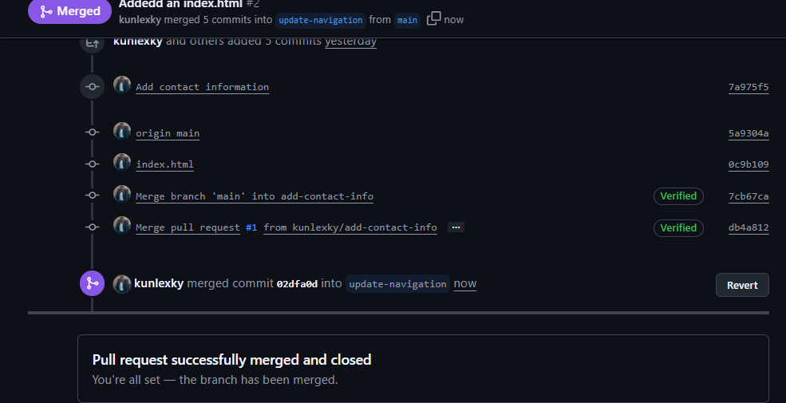
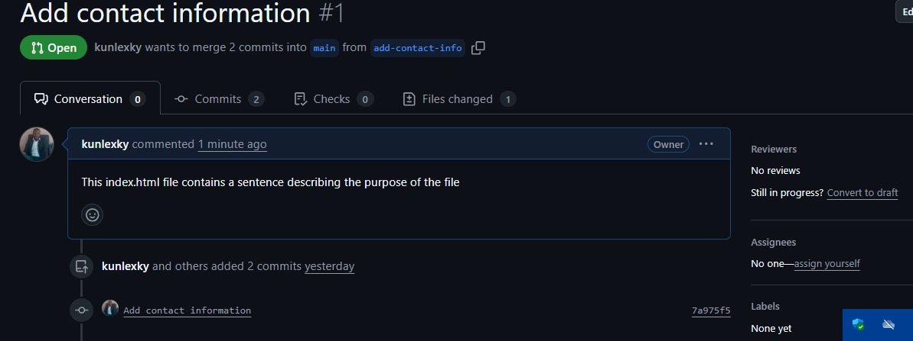
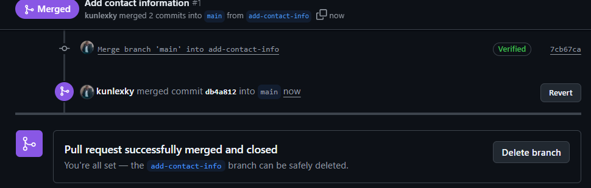

# Ai-Startup-Website2

## Installing Git

## Creating Repository

## Cloning the repository

# Tom's Work

# Jerry's Work

# Merging Changes

## Swithing to a branch

## Creating a pull request or Tom

## Tom's Merged 

## creating a pull request for Jerry

## Jerry's Merged

